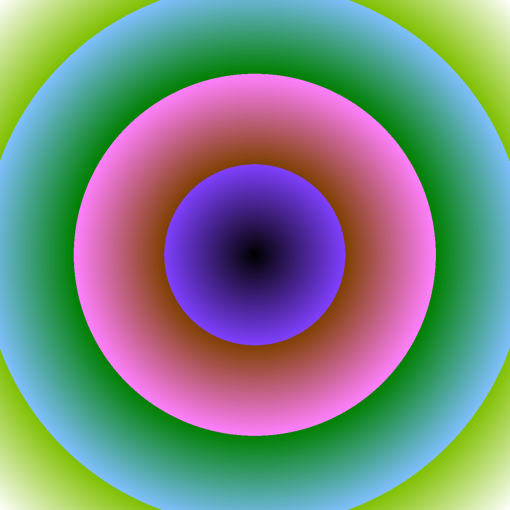
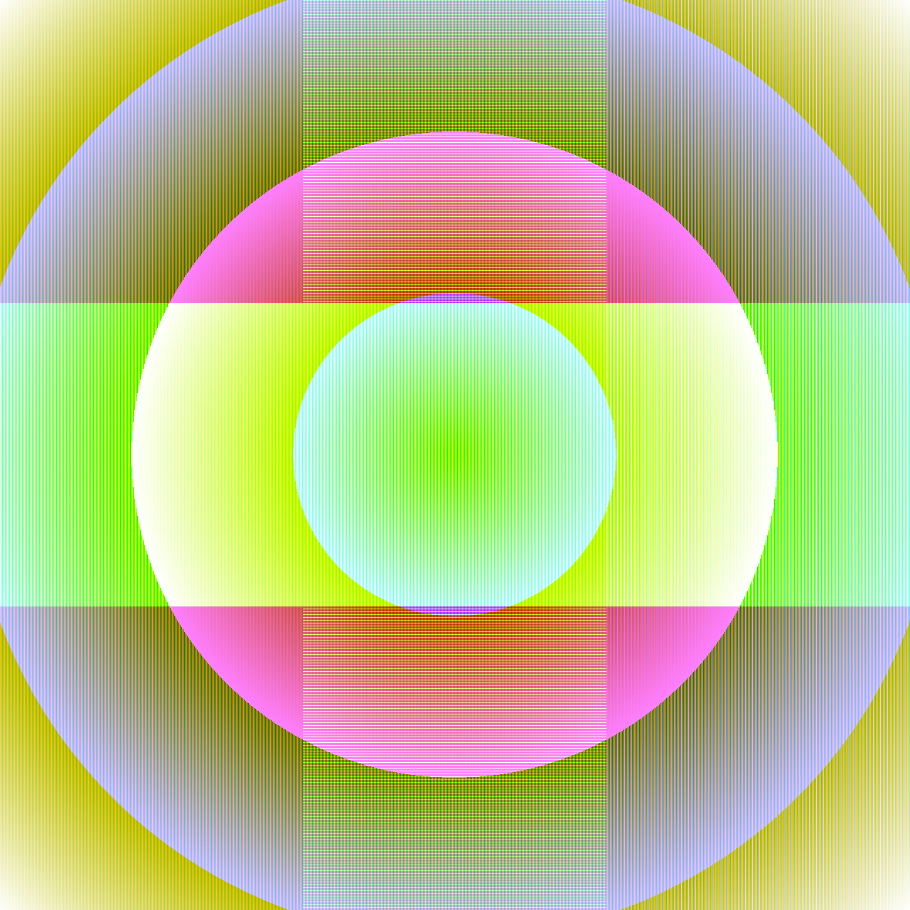
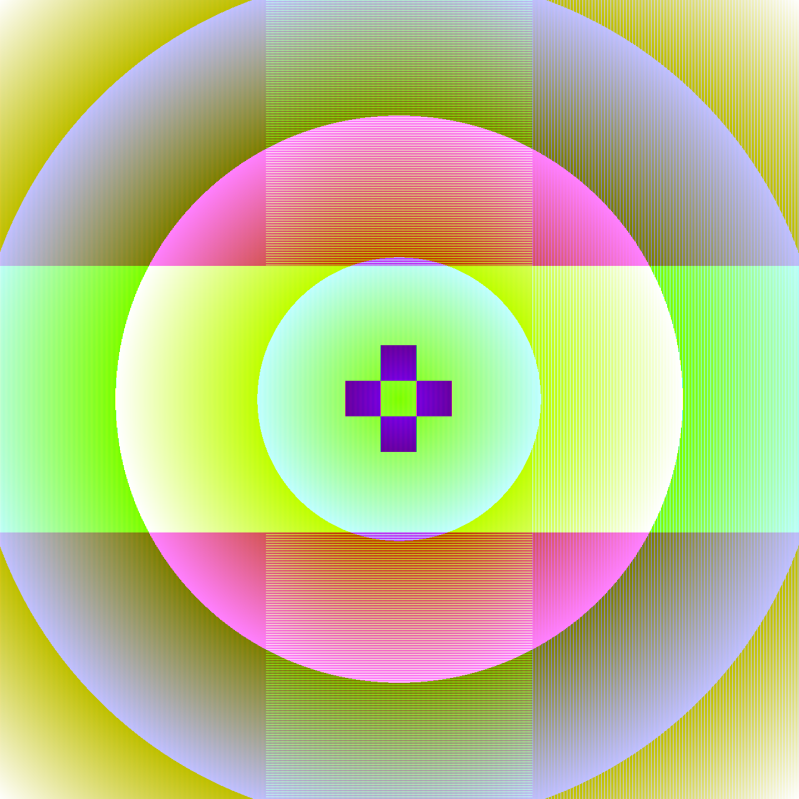
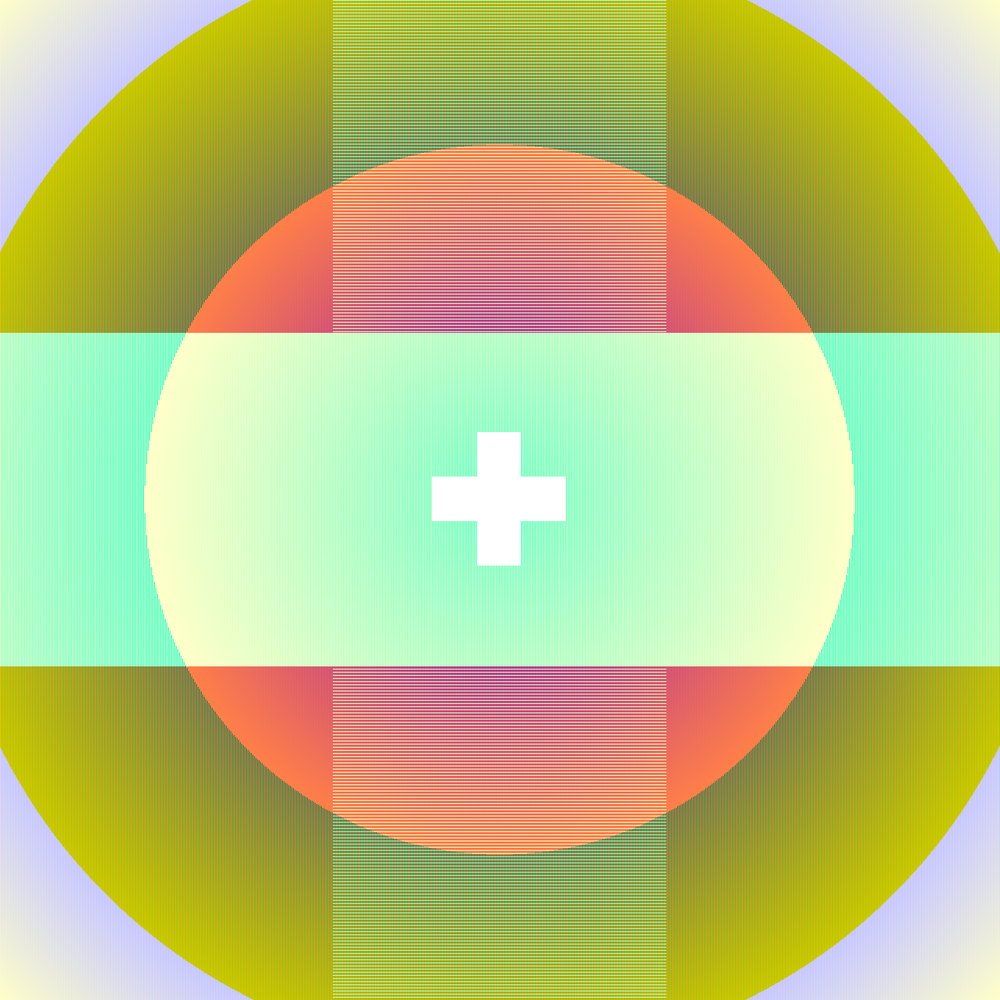
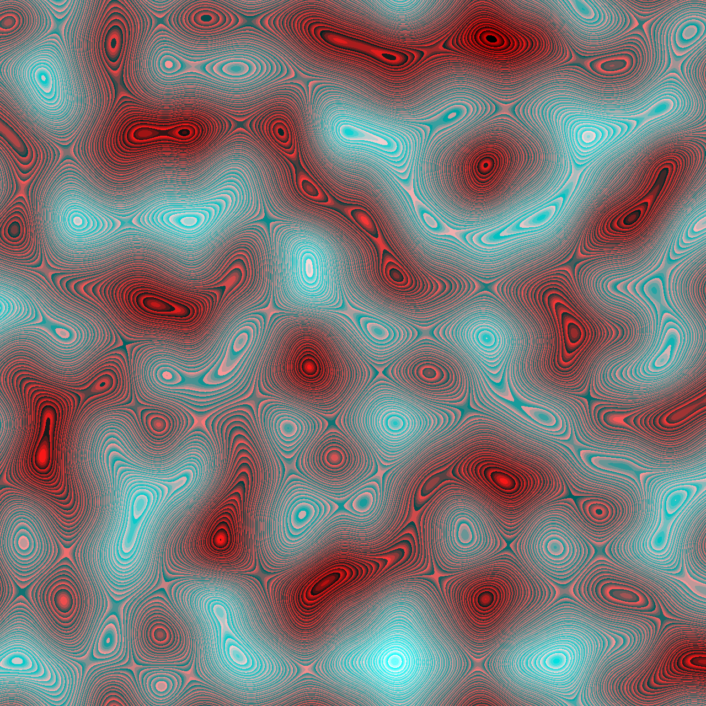
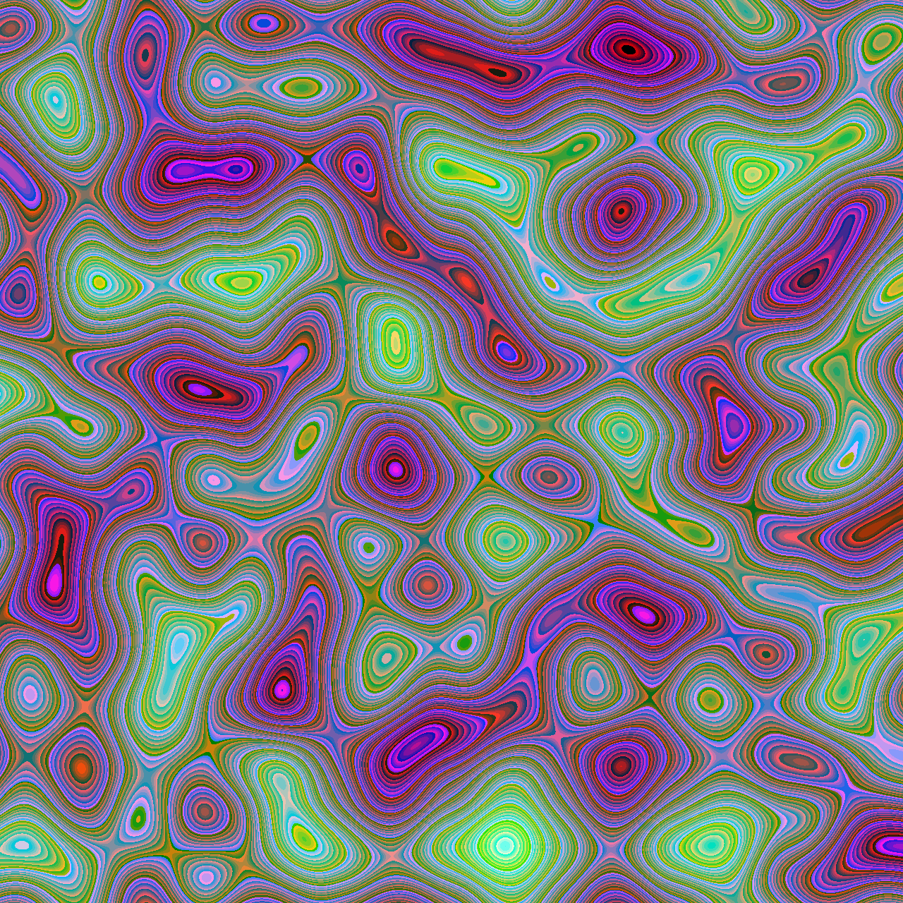
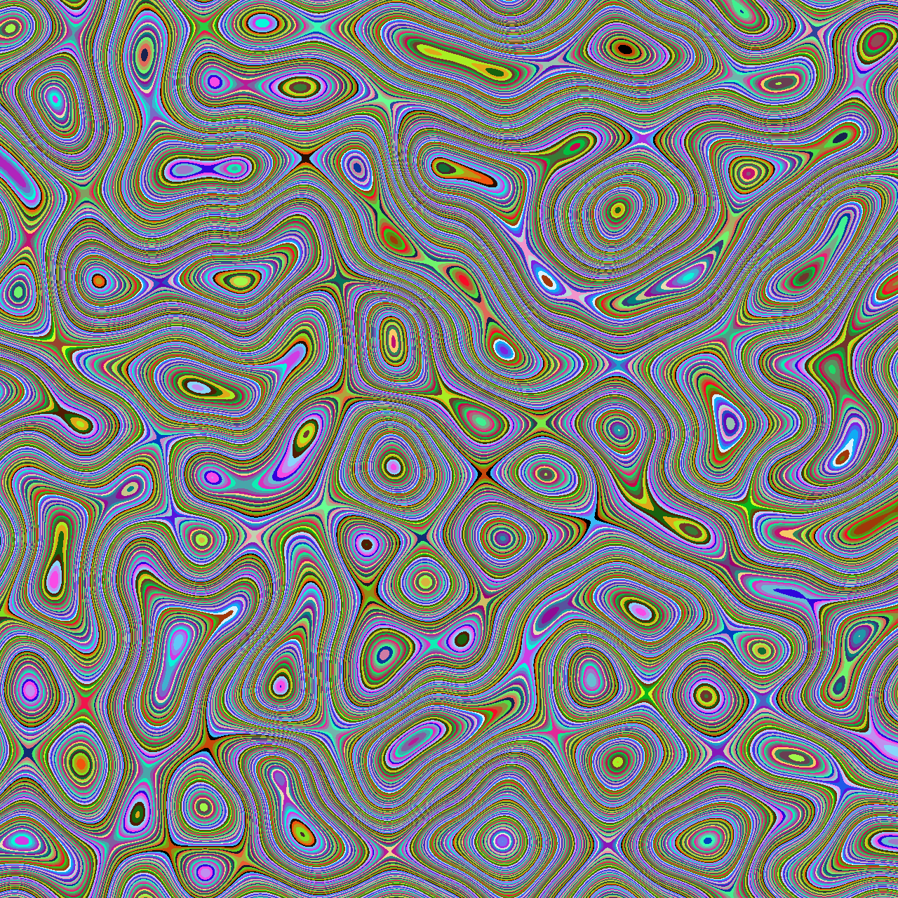

## Overview

This assignment investigates pixel-based pattern generation using NumPy array
operations. The focus is on understanding how array indexing, slicing, and
controlled randomness can be used to construct complex visual patterns without
explicit drawing primitives.

Two pattern families are explored:

1. A deterministic pattern combining a radial gradient, slicing-based stripe
   logic, and a cross-shaped geometric intervention.
2. A stochastic pattern generated using Perlin noise and non-linear RGB channel
   mappings.

The objective is to explore how simple numerical operations at the array level
can produce visually rich and interpretable results.

---

## Method

### Example 01: Gradient, Stripes, and Cross Intervention

This example is constructed through a sequence of deterministic array
operations applied to an initially empty RGB image.

**Procedure:**

1. A radial distance field is computed from the image center and normalized to
   produce a grayscale gradient.
2. The gradient is mapped differently to the red, green, and blue channels in
   order to introduce chromatic variation.
3. Stripe patterns are introduced using array slicing:
   - vertical red stripes created through column slicing
   - horizontal and vertical green bands defined by row and column ranges
   - sparse blue stripes applied to the right third of the image
4. A central cross-shaped region is defined using rectangular slicing and
   inverted relative to the surrounding pattern.
5. The same cross region is then overwritten with white, producing a dominant
   geometric intervention that interrupts the underlying gradient.
6. Finally, the blue channel is modified based on the inverted green channel,
   introducing an additional layer of channel dependency.

All operations rely exclusively on NumPy indexing and slicing.

---

### Example 02: Perlin Noise and Channel Manipulation

The second example explores stochastic pattern generation using Perlin noise as
a base signal.

**Procedure:**

1. A two-dimensional Perlin noise field is generated using a fixed random seed
   to ensure reproducibility.
2. The noise values are normalized to the range [0, 255].
3. The normalized noise is mapped to RGB channels using different scaling
   factors.
4. Values are cast to `uint8`, intentionally allowing overflow and wraparound
   behavior.
5. Additional variations are produced by selectively amplifying individual color
   channels while keeping the same underlying noise field.

This approach emphasizes how numeric representation and type casting influence
visual output.

---

## Results

### Example 01 – Deterministic Pattern Construction

The following images illustrate the stepwise construction of the deterministic
pattern:

---

### Example 02 – Stochastic Noise Variations

The following images show variations derived from the same Perlin noise field
with different channel mappings:

---

## Discussion

The first example demonstrates how deterministic array slicing enables precise
geometric control. The cross-shaped intervention shows how localized operations
can dominate an otherwise smooth global pattern.

The second example highlights the role of randomness and numeric representation.
The deliberate use of `uint8` wraparound introduces non-linear color behavior,
which becomes more apparent when zooming into the generated images.

Together, the examples illustrate how low-level array operations can serve as
powerful tools for pattern generation.

---

## Reproducibility

All stochastic processes use a fixed random seed (`SEED = 0`). Changing the seed
produces different noise realizations while preserving the same computational
logic. Image resolution and all parameters are explicitly defined in the script.

---

## AI Use

AI tools were used to assist with debugging, code cleanup, and documentation
structuring. All pattern logic, parameter choices, and visual evaluation were
performed by the student.
