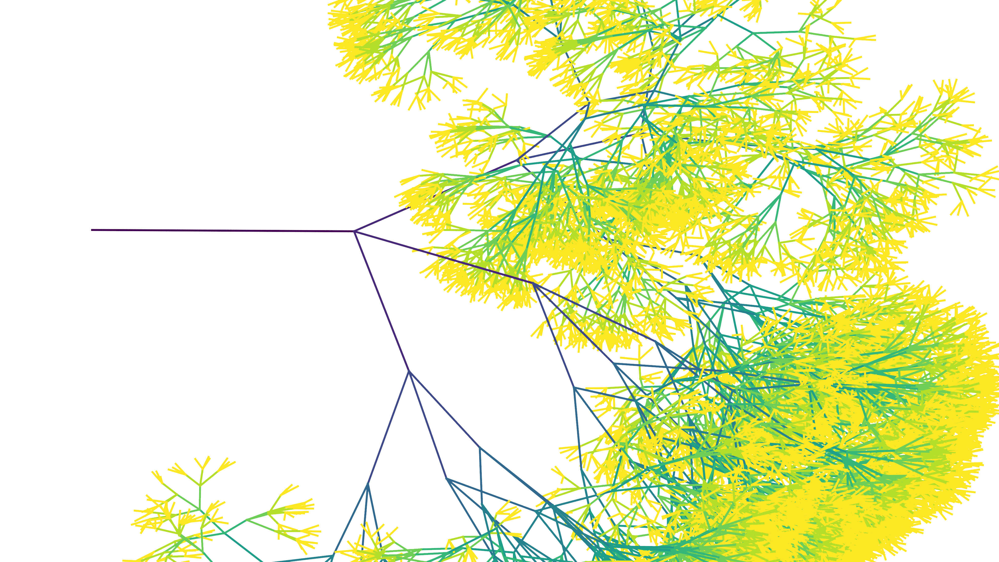

# Assignment 2: Exploring Fractals through Recursive Geometric Patterns

---

## Table of Contents
- [Overview](#overview)
- [Method](#method)
  - [Recursive Turn Generation](#recursive-turn-generation)
  - [From Turns to Geometry](#from-turns-to-geometry)
  - [Baseline Recursive Growth](#baseline-recursive-growth)
  - [Self-Avoiding Growth](#self-avoiding-growth)
  - [Attractor-Driven Growth](#attractor-driven-growth)
  - [Attractor with Self-Avoidance](#attractor-with-self-avoidance)
- [Results](#results)
- [Discussion](#discussion)
- [Reproducibility](#reproducibility)
- [AI Use](#ai-use)

---

## Overview

This assignment investigates a recursive geometric system based on the
Heighway dragon curve. Starting from a deterministic recursive definition,
the system is progressively modified by introducing geometric constraints
and spatial bias.

Four pattern variants are generated and compared across increasing iteration
depths (3, 7, 10, and 15):

1. A baseline recursive dragon curve.
2. A self-avoiding variant that rejects self-intersecting segments.
3. An attractor-driven variant that biases growth toward a target point.
4. A combined attractor and self-avoiding variant.

The objective is to examine how local rule modifications influence recursive
growth, geometric saturation, and global structure.

---

## Method

### Recursive Turn Generation

The dragon curve is defined by a recursive sequence of left and right turns.
At each iteration, the previous sequence is extended by appending a left turn
followed by the inverted and reversed version of the previous sequence.

This process produces a turn sequence of length `2^n − 1` at iteration `n`,
which defines the intended growth direction at each step.

---

### From Turns to Geometry

The turn sequence is converted into geometry using a step-based walker.
Starting from an initial position and heading, each turn updates the heading
and advances the walker by a fixed step length.

The resulting geometry is a polyline composed of axis-aligned segments.
All variants share this construction logic.

---

### Baseline Recursive Growth

The baseline variant executes the recursive turn sequence exactly as defined.
No turns are modified or rejected, and all steps are realized geometrically.

This produces a fully deterministic and self-similar fractal structure, where
increasing iteration depth directly increases geometric complexity.

---

### Self-Avoiding Growth

The self-avoid variant introduces a hard geometric constraint by rejecting any
step that would cause a self-intersection.

Each candidate segment is tested against all previously accepted segments.
If an intersection is detected, the step is skipped and the system attempts
to continue with subsequent turns.

At higher iteration depths, the curve may reach a saturated configuration
where no further non-intersecting steps are possible. In such cases, increasing
the iteration count does not increase realized geometry, and higher iterations
may produce identical results to lower ones.

---

### Attractor-Driven Growth

The attractor variant introduces a soft spatial bias toward a fixed point.
For each recursive turn, the planned turn is compared with its flipped
alternative. Both options are evaluated based on their alignment with the
direction toward the attractor.

If flipping the turn improves alignment, the turn may be flipped with a
probability controlled by a bias strength parameter.

This breaks the strict determinism of the recursive process while preserving
its overall structure.

---

### Attractor with Self-Avoidance

The final variant combines the attractor bias with self-intersection avoidance.

Turn decisions may be modified by the attractor, but resulting steps are still
subject to collision checks. Steps that would cause intersections are skipped.

This combination produces the strongest divergence from the baseline behavior
and may terminate early when no valid steps remain.

---

## Results

### Iteration 3

| Baseline | Self-Avoid |
| --- | --- |
|  |  |

| Attractor | Attractor + Self-Avoid |
| --- | --- |
|  |  |

---

### Iteration 7

| Baseline | Self-Avoid |
| --- | --- |
|  |  |

| Attractor | Attractor + Self-Avoid |
| --- | --- |
|  |  |

---

### Iteration 10

| Baseline | Self-Avoid |
| --- | --- |
|  |  |

| Attractor | Attractor + Self-Avoid |
| --- | --- |
|  |  |

---

### Iteration 15

| Baseline | Self-Avoid |
| --- | --- |
|  |  |

| Attractor | Attractor + Self-Avoid |
| --- | --- |
|  |  |

---

## Discussion

The baseline results demonstrate the predictable behavior of a purely recursive
system. Introducing self-avoidance shows how hard geometric constraints can
override recursive intent and lead to early saturation.

The attractor-based variants illustrate how soft spatial bias alters recursive
growth without explicitly redefining the recursion itself. Small turn
modifications propagate through subsequent steps, resulting in significant
geometric divergence at higher iterations.

Together, the results demonstrate how recursive systems are highly sensitive to
local rule changes and geometric constraints.

---

## Reproducibility

All stochastic processes use a fixed random seed (`SEED = 42`). For attractor-
based variants, the seed is reset before each run to ensure consistent behavior
across iteration depths.

---

## AI Use

AI tools were used to assist with debugging, code refinement, and documentation
structuring. All algorithmic decisions, parameter choices, and visual evaluation
were performed by the student.
