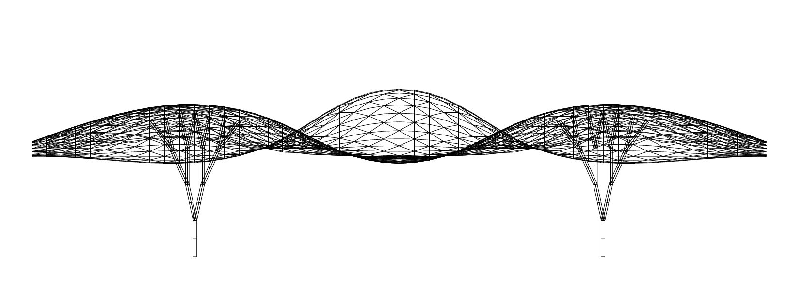

# Assignment 3: Parametric Structural Canopy

[View on GitHub]({{ site.github.repository_url }})



---

## Table of Contents
- [Overview](#overview)
- [Method](#method)
  - [Heightmap Surface](#heightmap-surface)
  - [Tessellation](#tessellation)
  - [Root Detection and Branching Supports](#root-detection-and-branching-supports)
  - [Sweep Geometry](#sweep-geometry)
  - [Pseudo-code](#pseudo-code)
- [Results](#results)
- [Discussion](#discussion)
- [Reproducibility](#reproducibility)
- [AI Use](#ai-use)

---

## Overview

This assignment builds a parametric canopy workflow in Grasshopper + GhPython:

1. Generate a heightmap-modulated canopy surface.
2. Tessellate the surface into panel curves and mesh.
3. Grow recursive branching supports from heightmap-driven root points.

The implementation is in:

- `parametric_canopy.py`

Core variation controls explored in the current exported iterations are:

- `freq_u`
- `freq_v`
- `branch_start_height`

---

## Method

### Heightmap Surface

The canopy starts from an input surface sampled in UV space. A NumPy heightmap
`H(U,V)` offsets points along local surface normals, then a new canopy surface
is reconstructed from displaced points.

The script supports multiple heightmap modes via `heightmap_type`, with wave-
based behavior driven by `amp`, `freq_u`, and `freq_v`.

---

### Tessellation

After displacement, the canopy is tessellated on the UV grid:

- `tessellation_type = 0`: quad cells.
- `tessellation_type = 1`: split triangles.

Panels are output as curves and as a mesh (`out_mesh`).

---

### Root Detection and Branching Supports

Root points are derived from local minima in the heightmap. Recursive support
branches are then generated from these roots using:

- `rec_depth`
- `n_branches`
- `br_length`
- `len_reduct`
- `branch_start_height`
- `extension_length`

Branch geometry is trimmed/culling-filtered against canopy limits for cleaner
structural output.

---

### Sweep Geometry

Support curves are converted to pipe-like/swept structural geometry, with
diameter controls and smoothing:

- `main_stem_diameter`
- `smooth_control`

---

### Pseudo-code

```python
# 1) Heightmap and displaced canopy points
Ug, Vg, H = generate_heightmap(..., amp, freq_u, freq_v, heightmap_type, seed)
pts_grid = displace_surface_points_along_normals(srf, Ug, Vg, H)
canopy_srf = rebuild_surface_from_grid(pts_grid)

# 2) Roots from local minima + tessellation
root_points = heightmap_local_minima_indices(H)
mesh, panels = tessellate_grid(pts_grid, tessellation_type)

# 3) Recursive supports
branches = generate_recursive_support_branches(
    roots, rec_depth, n_branches, br_length, len_reduct,
    branch_start_height, extension_length, trim_mesh=mesh
)

# 4) Sweep/pipe geometry for supports
support_sweeps = sweep_supports(branches, main_stem_diameter, smooth_control)
```

---

## Results

The current exported set contains two canopy iterations:

### Iteration 01


Parameters from screenshot:

- `amp = 5`
- `freq_u = 0.1`
- `freq_v = 0.1`
- `tessellation_type = 0`
- `heightmap_type = 0`
- `seed = 4`
- `rec_depth = 4`
- `n_branches = 3`
- `branch_start_height = 12`
- `extension_length = 10`
- `main_stem_diameter = 1.5`
- `smooth_control = 3`

---

### Iteration 02


Parameters from screenshot:

- `amp = 5`
- `freq_u = 0.3`
- `freq_v = 0.1`
- `tessellation_type = 0`
- `heightmap_type = 0`
- `seed = 4`
- `rec_depth = 4`
- `n_branches = 3`
- `branch_start_height = 12`
- `extension_length = 10`
- `main_stem_diameter = 1.5`
- `smooth_control = 3`

---

## Discussion

The two iterations show how frequency controls affect canopy articulation and,
in turn, influence support distribution and branch geometry. Increasing
`freq_u` from `0.1` to `0.3` increases directional oscillation in the canopy
surface, producing a denser variation pattern in panels and branch response.

`branch_start_height` remained fixed at `12` in both exported iterations, so
the main visible change in this set comes from the frequency shift.

---

## Reproducibility

To reproduce these results:

1. Use the same seed (`seed = 4`).
2. Keep all non-listed parameters fixed between runs.
3. Toggle only frequency parameters for comparison:
   - Iteration 01: `freq_u = 0.1`, `freq_v = 0.1`
   - Iteration 02: `freq_u = 0.3`, `freq_v = 0.1`

---

## AI Use

AI tools were used to assist with code cleanup and README structuring.
Algorithm design decisions, parameter choices, and model evaluation were
performed by the student.
